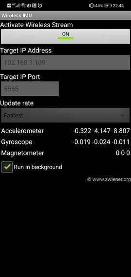
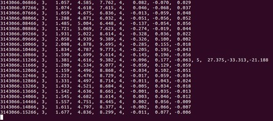

# android_imu

-----

## Usage

* start **Wireless IMU** Android apk, you can download it from [here](https://download.csdn.net/download/u011178262/12406719)

  

* `python scripts/imu_data_raw.py` or `rosrun android_imu imu_data_raw.py`

  

* if you want to publish `sensor_msgs/Imu` topic, replace `imu_data_raw.py` with `imu_data.py`